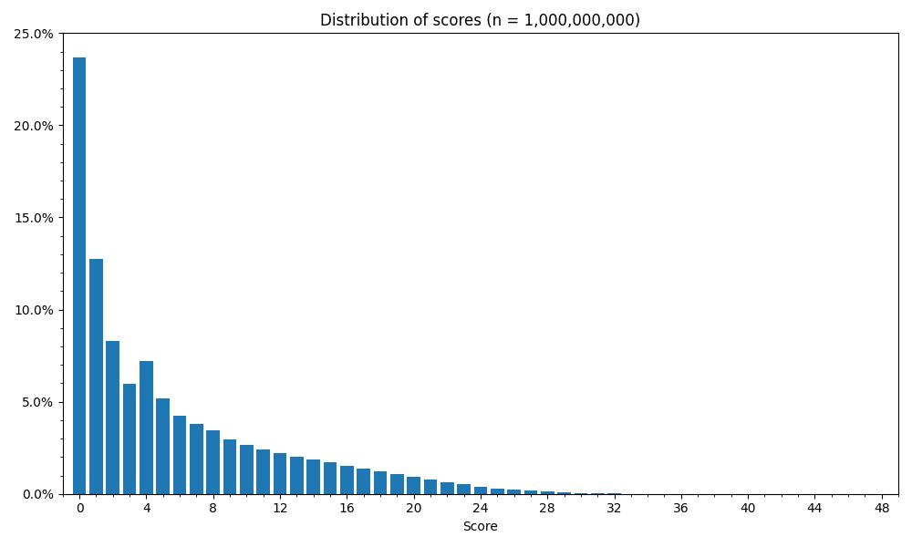

# Aces Up Solitaire Solver
**Brute‑force search and statistics for the solitaire game *Aces Up* (a.k.a. *Idiot's Delight*).**

```text
Number of games analyzed: 1,000,000

Win rate: 23.404% ± 0.165% (Clopper-Pearson w/ 99.99% CI)
```

## Rules

Four tableau piles are dealt in batches of four. Whenever two top cards share a suit, discard the lower rank. Any exposed card that sits on top of another card may be moved to an empty pile. Keep dealing cards until there are no more cards in the deck.

The game is scored from 0 to 48 depending on how many non-ace cards are left when all legal moves have been exhausted, with a score of zero counting as a win.

## Solver

The solver uses a naive depth‑first brute-force search which explores every possible move sequence and records the lowest possible score.

This can be thought of as the *thoughtful* variant of the game, where the entire deck order is known, and the player can make the best choice on which exposed card to move to an empty pile (or to keep it empty) before the next deal.

## Results

I hadn't found any previous results on the winnability of Aces Up, except for the Wikipedia quote that ["Winning chances with good play are about 1 in 43"](https://en.wikipedia.org/wiki/Aces_Up).

For any given shuffle however, the solvability is a lot higher, namely 23.404% ± 0.165% using Clopper-Pearson (exact) with a 99.99% confidence interval (23.239%&ndash;23.569%).

Running the search for n = 1,000,000 games takes around 40 minutes on my Macbook, and the worst score found was 42 (with seed = 1635014440093633329).


*Figure&nbsp;1. Distribution of scores (n = 1,000,000).*

Note that a score of 3 is less likely than a score of 4. Other than that the distribution trends downwards, with a score of 0 being the most common.

For example runs see [/examples](examples).

## License

This project is licensed under the MIT License - see [`LICENSE`](LICENSE).
